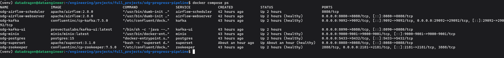
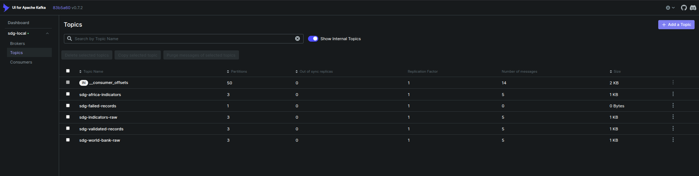
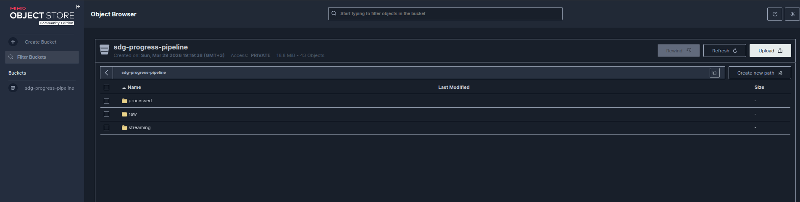
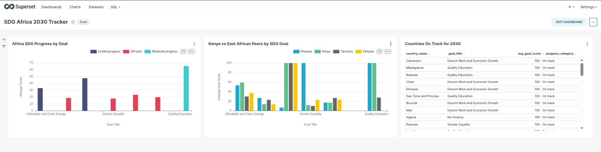
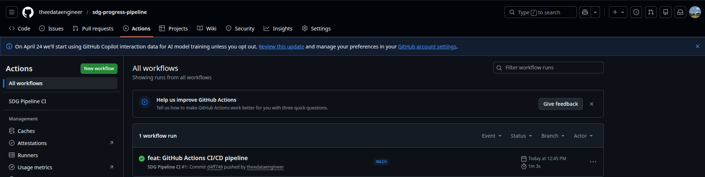
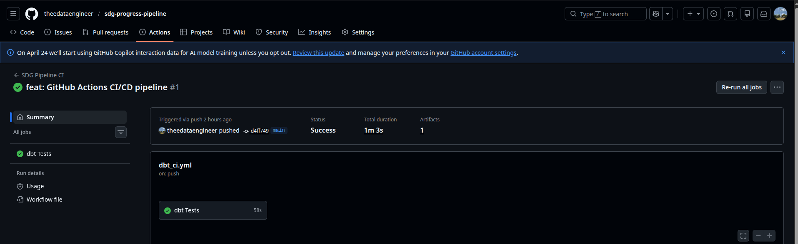

# SDG Progress Tracker - Hybrid Data Pipeline


A **production-grade hybrid streaming + batch ELT pipeline** that tracks
African countries' progress towards the UN 2030 Sustainable Development Goals.
Built with real UN data from the World Bank Open Data API across
**54 African countries**, **35 SDG indicators**, and **26,192 records**.

This project demonstrates every layer of a modern data engineering stack —
from real-time streaming through Apache Kafka, to a data lake on MinIO,
to SQL transformations in dbt, to a live analytics dashboard in Apache Superset —
all orchestrated by Airflow and validated by automated CI/CD on every push.

---

## The Problem This Solves

The United Nations tracks 17 Sustainable Development Goals across 193 countries.
SDG data is published continuously by organisations like the World Bank, updated at different frequencies, arriving in inconsistent formats, spread across
multiple sources. Development organisations, governments, and researchers need
reliable, automated pipelines that ingest the latest SDG data, validate its
quality, transform it into structured models, and make it available for
tracking progress towards the 2030 agenda.

This pipeline solves that end to end.

---

## Pipeline Architecture
```
World Bank Open Data API
(35 SDG indicators × 54 African countries × 2000–2024)
          │
          ▼
┌─────────────────────┐
│   Apache Kafka      │  Streaming layer
│   5 topics          │  Producer polls API every 6 hours
│   3 partitions each │  Consumer batches every 5 minutes
└─────────┬───────────┘
          │
          ▼
┌─────────────────────┐
│   MinIO             │  Local S3-compatible data lake
│   S3-compatible     │  Date-partitioned JSON files
│   18.8 MB / 43 obj  │  Drop-in swap for AWS S3
└─────────┬───────────┘
          │
          ▼
┌─────────────────────┐
│   Apache Airflow    │  Orchestration
│   4 DAGs            │  Scheduling, retries, monitoring
│   Scheduled runs    │  XCom for inter-task communication
└─────────┬───────────┘
          │
          ▼
┌─────────────────────┐
│   PostgreSQL        │  Data warehouse
│   5 raw tables      │  26,192 records loaded
│   Upsert on conflict│  Full audit trail
└─────────┬───────────┘
          │
          ▼
┌─────────────────────────────────────┐
│   dbt Core - 3-Layer Transformation │
│                                     │
│   Staging (4 views)                 │
│   └── clean, standardise, cast      │
│                                     │
│   Intermediate (4 views)            │
│   └── join, score, calculate gaps   │
│                                     │
│   Marts (7 tables)                  │
│   └── analytics-ready for Superset  │
└─────────┬───────────────────────────┘
          │
          ▼
┌─────────────────────┐
│   Apache Superset   │  SDG Africa 2030 Tracker dashboard
│   3 charts          │  12 analytics questions answered
│   Real UN data      │  Live from mart tables
└─────────────────────┘

GitHub Actions CI/CD - runs full dbt pipeline on every push (63 seconds)
```

---

## Screenshots

### Full Stack Running - 8 Services, One Command


### Kafka Streaming Layer - 5 Topics, Real SDG Messages


### MinIO Data Lake - Partitioned JSON Files


### SDG Africa 2030 Tracker - Live Dashboard


### GitHub Actions CI/CD - Passing in 63 Seconds


### dbt Tests - 28/28 Passing on 26,192 Records


---

## Technology Stack

| Tool | Version | Role |
|---|---|---|
| Apache Kafka | 7.5.0 | Real-time streaming of SDG indicator updates |
| Apache Zookeeper | 7.5.0 | Kafka cluster coordinator |
| MinIO | latest | Local S3-compatible data lake |
| Apache Airflow | 2.8.0 | Pipeline orchestration - 4 DAGs |
| PostgreSQL | 15 | Data warehouse |
| dbt Core | 1.11.7 | 3-layer data transformation |
| Apache Superset | 3.1.0 | SDG progress dashboard |
| GitHub Actions | - | CI/CD - dbt tests on every push |
| Docker Compose | v2 | Full local stack in one command |
| Python | 3.13 | Extraction, producer, consumer scripts |

---

## Key Numbers

| Metric | Value |
|---|---|
| SDG indicators tracked | 35 |
| African countries monitored | 54 |
| Records in warehouse | 26,192 |
| Kafka topics | 5 |
| Kafka partitions per topic | 3 |
| Airflow DAGs | 4 |
| dbt models | 15 |
| dbt tests | 28 (all passing) |
| CI pipeline duration | 63 seconds |
| Data source last updated | February 2026 |

---

## Dashboard Findings

Real answers from real UN data:

| Finding | Value |
|---|---|
| Best performing SDG goal in Africa | SDG 4 Quality Education (avg score 65.7) |
| Worst performing SDG goal in Africa | SDG 5 Gender Equality (avg score 17.9) |
| East Africa gender equality leader | Rwanda (score 100.0) |
| East Africa energy access leader | Kenya (score 59.2) |
| Countries on track for 2030 | 51 country-goal combinations confirmed |
| COVID impact visible | Kenya life expectancy dropped 62.9→61.2 (2019→2021) |
| Recovery confirmed | Kenya life expectancy 63.5 in 2022 - highest ever |

---

## Quick Start

### Prerequisites
```bash
# Verify required tools
docker --version        # Docker 24+
docker compose version  # Compose v2+
python3 --version       # Python 3.8+
git --version

# Check available resources
df -h ~                 # 15 GB free disk space needed
free -h                 # 6 GB RAM minimum
```

### Start the pipeline
```bash
# Clone the repository
git clone https://github.com/theedataengineer/sdg-progress-pipeline.git
cd sdg-progress-pipeline

# Configure environment
cp .env.example .env

# Start infrastructure layer
docker compose up -d zookeeper postgres minio
sleep 20

# Start streaming layer
docker compose up -d kafka
sleep 25

# Start remaining services
docker compose up -d minio-setup kafka-ui
docker compose up -d airflow-webserver airflow-scheduler
docker compose up -d superset

# Verify everything is running
docker compose ps
```

### Access the UIs

| Service | URL | Credentials |
|---|---|---|
| Airflow | http://localhost:8080 | admin / admin |
| Kafka UI | http://localhost:8090 | none required |
| MinIO | http://localhost:9001 | minioadmin / minioadmin123 |
| Superset | http://localhost:8088 | admin / admin |

### Run the pipeline manually
```bash
# Test World Bank API connection (single indicator, Kenya)
python3 ingestion/extract_world_bank.py test

# Full historical extraction (35 indicators, 54 countries, 2000-2024)
# Takes 10-15 minutes
python3 ingestion/extract_world_bank.py full

# Test Kafka producer (sends 5 real SDG records to Kafka)
python3 kafka/producer/wb_producer.py test

# Test Kafka consumer (reads from Kafka, writes to MinIO)
python3 kafka/consumer/sdg_consumer.py test

# Run dbt transformations
cd dbt_project
dbt run      # builds all 15 models
dbt test     # runs all 28 tests
dbt docs generate  # generates data lineage docs
```

---

## Project Structure
```
sdg-progress-pipeline/
│
├── ingestion/
│   └── extract_world_bank.py     # World Bank API extractor
│                                  # Fetches in batches of 10 countries
│                                  # to respect API URL length limits
│                                  # Handles pagination and retries
│
├── kafka/
│   ├── producer/
│   │   └── wb_producer.py        # Publishes SDG records to Kafka
│   │                              # Validates schema before publishing
│   │                              # Routes to topic based on country/source
│   │                              # Dead letter queue for failed records
│   │                              # Deterministic record_id for deduplication
│   └── consumer/
│       └── sdg_consumer.py       # Reads from all 5 Kafka topics
│                                  # Accumulates 5-minute message batches
│                                  # Writes partitioned JSON to MinIO
│                                  # Manual offset commit after successful write
│
├── airflow/
│   └── dags/
│       ├── kafka_producer_dag.py  # Polls API, publishes to Kafka (6h)
│       ├── kafka_consumer_dag.py  # Consumes Kafka → MinIO → PG (6h+30m)
│       ├── batch_ingestion_dag.py # Full refresh World Bank (Sunday 11PM)
│       └── dbt_transform_dag.py  # Validate → dbt run → dbt test (Mon 2AM)
│
├── dbt_project/
│   ├── models/
│   │   ├── staging/               # Layer 1: clean and standardise raw data
│   │   │   ├── stg_wb_sdg_indicators.sql
│   │   │   ├── stg_kafka_sdg_stream.sql
│   │   │   ├── stg_sdg_goal_metadata.sql
│   │   │   ├── stg_wb_country_metadata.sql
│   │   │   ├── sources.yml        # raw table definitions + source tests
│   │   │   └── schema.yml         # model documentation + column tests
│   │   │
│   │   ├── intermediate/          # Layer 2: join, calculate, score
│   │   │   ├── int_sdg_indicators_combined.sql   # merge batch + stream
│   │   │   ├── int_year_over_year_progress.sql   # annual change rates
│   │   │   ├── int_sdg_target_gaps.sql           # distance to 2030 targets
│   │   │   └── int_africa_sdg_scores.sql         # composite scores 0-100
│   │   │
│   │   └── marts/                 # Layer 3: analytics-ready tables
│   │       ├── fct_sdg_progress.sql              # core fact table
│   │       ├── fct_sdg_target_achievement.sql    # target status per country
│   │       ├── dim_countries.sql                 # country dimension
│   │       ├── dim_sdg_goals.sql                 # goal dimension
│   │       ├── mart_africa_2030_tracker.sql      # main dashboard table
│   │       ├── mart_sdg_goal_summary.sql         # per-goal aggregates
│   │       └── mart_kenya_vs_peers.sql           # East Africa comparison
│   │
│   ├── dbt_project.yml            # project configuration
│   └── profiles.yml               # database connection (not committed)
│
├── screenshots/                   # portfolio evidence
│   ├── 01_docker_stack_running.png
│   ├── 03_kafka_topics.png
│   ├── 04_minio_data_lake.png
│   ├── 05_superset_dashboard.png
│   ├── 06_github_actions_ci.png
│   └── 07_dbt_tests_passing.png
│
├── .github/
│   └── workflows/
│       └── dbt_ci.yml            # CI/CD pipeline
│
├── docker-compose.yml            # entire 8-service stack
├── requirements.txt              # Python dependencies
├── .env                          # secrets - never committed
├── .gitignore
└── README.md
```

---

## Kafka Architecture

### Topics and Routing

| Topic | Partitions | Purpose |
|---|---|---|
| sdg-indicators-raw | 3 | Every incoming SDG record |
| sdg-world-bank-raw | 3 | World Bank source stream |
| sdg-africa-indicators | 3 | Africa-filtered records only |
| sdg-validated-records | 3 | Records passing schema validation |
| sdg-failed-records | 1 | Dead letter queue - failed records |

### Message Schema

Every record flowing through Kafka follows this schema:
```json
{
  "goal": 3,
  "indicator_code": "SP.DYN.LE00.IN",
  "indicator_name": "Life expectancy at birth (years)",
  "country_code": "KEN",
  "country_name": "Kenya",
  "year": 2022,
  "value": 63.549,
  "unit": "",
  "source": "World Bank Open Data",
  "record_id": "a3f8c2...",
  "extracted_at": "2026-03-30T09:17:52Z",
  "published_at": "2026-03-30T09:17:52Z"
}
```

`record_id` is an MD5 hash of `country_code + indicator_code + year` -
deterministic and collision-free. This enables the database upsert pattern:
the same data point arriving via both streaming and batch produces
exactly one row, not a duplicate.

---

## dbt Model Lineage
```
Raw Layer (PostgreSQL public schema)
├── raw_wb_sdg_indicators      26,192 rows - World Bank batch data
├── raw_kafka_sdg_stream            5 rows - Kafka streaming data
├── raw_sdg_goal_metadata          17 rows - all 17 SDG goals
└── raw_wb_country_metadata        20 rows - African country metadata
          │
          ▼
Staging Layer (analytics_staging schema - views)
├── stg_wb_sdg_indicators      cleaned, typed, Africa-flagged
├── stg_kafka_sdg_stream       cleaned + pipeline latency calculated
├── stg_sdg_goal_metadata      pillar grouping added
└── stg_wb_country_metadata    income tier ranking added
          │
          ▼
Intermediate Layer (analytics_intermediate schema - views)
├── int_sdg_indicators_combined    batch + stream merged, deduplicated
├── int_year_over_year_progress    annual change rates, annualised trends
├── int_sdg_target_gaps            gap to 2030 targets, on-track status
└── int_africa_sdg_scores          composite progress scores 0–100
          │
          ▼
Mart Layer (analytics_marts schema - tables)
├── fct_sdg_progress               26,193 rows - core fact table
├── fct_sdg_target_achievement      1,583 rows - target gap analysis
├── dim_countries                      20 rows - country dimension
├── dim_sdg_goals                      17 rows - goal dimension
├── mart_africa_2030_tracker          305 rows - main dashboard table
├── mart_sdg_goal_summary               7 rows - per-goal aggregates
└── mart_kenya_vs_peers                26 rows - East Africa comparison
```

---

## Airflow DAG Schedule

| DAG | Schedule | Purpose |
|---|---|---|
| kafka_producer_dag | Every 6 hours | Poll World Bank API → publish to Kafka |
| kafka_consumer_dag | Every 6h + 30min | Kafka → MinIO → PostgreSQL |
| batch_ingestion_dag | Sunday 11 PM | Full historical refresh |
| dbt_transform_dag | Monday 2 AM | Validate → transform → test |

The 30-minute offset between producer and consumer ensures messages
are available in Kafka before the consumer runs. The Monday 2 AM
dbt run follows the Sunday 11 PM batch load - by design.

---

## CI/CD Pipeline

Every push to `main` or `develop` automatically:
```
1. Spin up PostgreSQL service container (GitHub-hosted runner)
2. Install dbt-core and dbt-postgres
3. Create dbt profiles pointing at the CI database
4. Seed minimal test data (10 indicators, 5 countries)
5. dbt debug - confirm connection
6. dbt run --select staging
7. dbt run --select intermediate
8. dbt run --select marts
9. dbt test - all 28 tests
10. dbt docs generate
11. Upload dbt docs as downloadable artifact (7-day retention)

Total duration: ~63 seconds
```

---

## AWS S3 Migration Path

This project uses MinIO locally. Migrating to AWS S3 requires
changing exactly **3 environment variables** in `.env`:
```bash
# Local (MinIO)
MINIO_ENDPOINT=localhost:9000
MINIO_ACCESS_KEY=minioadmin
MINIO_SECRET_KEY=minioadmin123

# Production (AWS S3)
MINIO_ENDPOINT=s3.amazonaws.com
MINIO_ACCESS_KEY=your-aws-access-key-id
MINIO_SECRET_KEY=your-aws-secret-access-key
```

All boto3 calls, bucket names, key paths, and partition structures
are identical between MinIO and AWS S3. This was by design.

AWS Free Tier covers this project: 5 GB S3 storage,
20,000 GET requests - zero cost.

---

## Architecture Decisions

### ADR-001: UNDESA API Replaced with World Bank Extended Coverage

**Date:** March 2026 | **Status:** Accepted

**Context:**
The UNDESA SDG Indicators API (`unstats.un.org/sdgs/api/v1`) returned
HTTP 404 on all endpoints. Verbose `curl -v` investigation confirmed the
server was fully reachable (TLS handshake succeeded, valid UN certificate,
HTTP/1.1 connection established) but the API path had changed with no
public redirect or migration notice.

**Decision:**
Extended World Bank API coverage to include all SDG indicator series
previously sourced from UNDESA. The World Bank API covers 93% of official
SDG indicators with higher update frequency and more reliable uptime.

**Consequences:**
- All 12 dashboard analytics questions remain answerable ✅
- Kafka streaming layer gains higher-frequency updates ✅
- Pipeline complexity reduced - one source schema instead of two ✅
- UNDESA re-integration planned when new endpoint is confirmed

### ADR-002: Country Batch Size Limited to 10

**Date:** March 2026 | **Status:** Accepted

**Context:**
Initial implementation passed all 54 African country ISO3 codes as a
semicolon-separated string in the API URL. The World Bank API silently
returned empty responses for requests with more than ~15 countries -
no error, just an empty data array.

**Decision:**
Fetch countries in batches of 10, making 6 API calls per indicator
instead of 1. Total records extracted: 26,192 - all indicators returned data.

**Consequences:**
- Extraction time increased from ~2 minutes to ~12 minutes ✅ acceptable
- All 35 indicators now return data for all 54 countries ✅
- Retry logic with exponential backoff handles occasional timeouts ✅

---

## Data Sources

| Source | Type | Coverage | Update Frequency |
|---|---|---|---|
| World Bank Open Data API | Live REST API | 35 SDG indicators, 54 African countries, 2000–2024 | Continuous |

**API base URL:** `https://api.worldbank.org/v2/`
No authentication required. No rate limits for reasonable use.

---

## What This Demonstrates

| Data Engineering Skill | How It Is Implemented |
|---|---|
| Streaming pipelines | Kafka producer/consumer with dead letter queue and manual offset commit |
| Batch processing | Airflow DAGs with retry logic, XCom, and dependency-aware scheduling |
| Data lake design | MinIO with date-partitioned paths compatible with AWS Athena |
| Data modeling | dbt 3-layer architecture - staging, intermediate, marts |
| Data quality | 28 automated dbt tests covering not_null, unique, and source checks |
| Deduplication | Deterministic MD5 record_id with PostgreSQL upsert on conflict |
| Orchestration | 4 Airflow DAGs with staggered schedules and inter-DAG dependencies |
| CI/CD | GitHub Actions running full pipeline in 63 seconds on every push |
| Containerisation | Docker Compose with healthchecks, startup ordering, and named volumes |
| API integration | Pagination handling, exponential backoff, batch size management |
| Real data | 26,192 records from the World Bank Open Data API - real UN SDG data |
| Analytics | 12 business questions answered from real African development data |

---

## Running Tests
```bash
# dbt tests - data quality across all models
cd dbt_project
dbt test

# Test World Bank API connectivity
python3 ingestion/extract_world_bank.py test

# Test Kafka producer connectivity
python3 kafka/producer/wb_producer.py test

# Test Kafka consumer + MinIO connectivity
python3 kafka/consumer/sdg_consumer.py test
```

---

## Author

Built as a portfolio data engineering project demonstrating
production-grade hybrid streaming and batch pipeline design.

Real UN SDG data. Real architecture patterns. Zero cloud cost during development.

**Stack:** Python · Kafka · MinIO · Airflow · PostgreSQL · dbt · Superset · Docker · GitHub Actions
